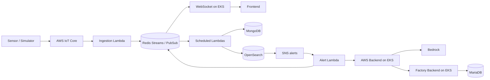

# Factory Tycoon - Cloud Infrastructure

[한국어](README.md) | **English**

Factory Tycoon is a team project that connects factory operations, IoT sensor monitoring, anomaly detection, and AI analysis. Its repositories cover data collection, backend services, the web interface, and cloud deployment.

**Terraform configuration for Factory Tycoon's AWS infrastructure and sensor processing pipeline.** Feature-specific directories cover networking, EKS, data services, IoT ingestion, and GitOps.

## Architecture



The ingestion Lambda writes to Redis Streams and publishes live data through Pub/Sub. Separate Lambdas persist data to MongoDB and OpenSearch. The alert handler calls a backend API and forwards the response to the Redis alert channel.

## Infrastructure layout

| Directory | Responsibility |
| --- | --- |
| [vpc](vpc), [security-groups](security-groups) | Networking and security groups |
| [eks](eks) | Kubernetes cluster, nodes, and service integration |
| [elasticache](elasticache) | Redis |
| [iot](iot) | IoT devices, certificates, and message ingestion settings |
| [lambda](lambda), [sns](sns) | Processing functions, schedules, and notifications |
| [opensearch](opensearch) | Search and analytics domain |
| [s3](s3), [cloudfront](cloudfront) | Object storage and frontend delivery infrastructure |
| [argocd](argocd) | Argo CD, applications, ConfigMaps, and Secrets |
| [ec2](ec2) | Additional EC2 workloads |

## Design highlights

- **Infrastructure and workload separation**: AWS resources live here; application Helm charts live in the Kubernetes repository
- **Separate persistence and live delivery**: Redis Streams support downstream ingestion while Pub/Sub carries live messages
- **GitOps configuration**: Argo CD is configured to synchronize Helm charts and Ingress changes
- **Per-function packaging**: separate Python code and dependencies for each Lambda, with a shared build script

## Prepare deployment

You need Terraform, AWS CLI, kubectl, Helm, and a Python environment for Lambda packaging. Each directory is an independent Terraform configuration with remote state and dependencies on other configurations' outputs.

1. Configure credentials for the target AWS account.
2. Review the S3 state backend and region in each configuration's `versions.tf` and `providers.tf`. Project-specific state bucket names need adjustment for another environment.
3. Prepare inputs using each `variables.tf`. Argo CD includes a [terraform.tfvars.example](argocd/terraform.tfvars.example).
4. Adapt resource names, domains, repository URLs, and database connections. Argo CD settings still reference the previous organization (`lgcns5team`).

Example of reviewing an individual configuration:

```bash
cd vpc
terraform init -reconfigure
terraform plan
```

After reviewing the plan, apply it with `terraform apply` in that directory. Package Lambda dependencies using [lambda/build.sh](lambda/build.sh) before deploying the functions.

[deploy-all.sh](deploy-all.sh) automatically applies `vpc → security-groups → eks → elasticache → iot → opensearch → lambda`. It does not include `argocd`, `sns`, `s3`, `cloudfront`, or `ec2`; a complete environment needs prerequisite configuration and separate applies. The script uses `-auto-approve`.

## Operations and detailed guides

```bash
kubectl get nodes
kubectl get pods -n default
kubectl get ingress -n default
```

- [Argo CD guide](argocd/README.md) (Korean)
- [Lambda guide](lambda/README.md) (Korean)
- [OpenSearch guide](opensearch/README.md) (Korean) and [SSM tunnel script](opensearch-tunnel.sh)
- [destroy-all.sh](destroy-all.sh): resource removal script; inspect its scope before use

## Related repositories

| Repository | Role |
| --- | --- |
| [factory-tycoon-frontend](https://github.com/factorytycoon/factory-tycoon-frontend) | Web dashboard and 3D factory visualization |
| [factory-tycoon-backend](https://github.com/factorytycoon/factory-tycoon-backend) | Factory operations and authentication API |
| [factory-tycoon-backend-aws](https://github.com/factorytycoon/factory-tycoon-backend-aws) | Bedrock AI analysis and S3/OpenSearch integration |
| [factory-tycoon-backend-websocket](https://github.com/factorytycoon/factory-tycoon-backend-websocket) | Live sensor and alert delivery |
| [factory-tycoon-sensor-simulator](https://github.com/factorytycoon/factory-tycoon-sensor-simulator) | Simulated sensor data and MQTT publishing |
| [factory-tycoon-opensearch](https://github.com/factorytycoon/factory-tycoon-opensearch) | Anomaly detection and alert configuration assets |
| [factory-tycoon-cloud](https://github.com/factorytycoon/factory-tycoon-cloud) | AWS infrastructure and Lambda with Terraform |
| [factory-tycoon-k8s](https://github.com/factorytycoon/factory-tycoon-k8s) | Helm and Kubernetes deployment configuration |
