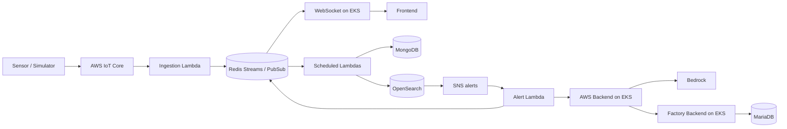

# Factory Tycoon - Cloud Infrastructure

**한국어** | [English](README.en.md)

Factory Tycoon은 공장 운영 관리, IoT 센서 모니터링, 이상 탐지, AI 분석을 연결하는 스마트 팩토리 팀 프로젝트입니다. 여러 저장소가 데이터 수집부터 웹 화면과 클라우드 배포까지 역할을 나누어 구성합니다.

**Factory Tycoon의 AWS 인프라와 센서 처리 파이프라인을 Terraform으로 구성하는 저장소입니다.** 네트워크, EKS, 데이터 서비스, IoT 수집, GitOps 설정을 기능별 디렉터리로 관리합니다.

## 아키텍처



수집 Lambda는 Redis Streams에 저장하고 Pub/Sub로 실시간 데이터를 발행합니다. 별도 Lambda가 MongoDB와 OpenSearch에 데이터를 적재합니다. 알람 처리 Lambda는 백엔드 API를 호출하고 응답을 Redis 알람 채널에 전달합니다.

## 인프라 구성

| 디렉터리 | 역할 |
| --- | --- |
| [vpc](vpc), [security-groups](security-groups) | 네트워크와 보안 그룹 |
| [eks](eks) | Kubernetes 클러스터, 노드, 서비스 연동 구성 |
| [elasticache](elasticache) | Redis |
| [iot](iot) | IoT 장치, 인증서, 메시지 수집 설정 |
| [lambda](lambda), [sns](sns) | 센서 처리 함수, 스케줄, 알림 연결 |
| [opensearch](opensearch) | 검색 및 분석 도메인 |
| [s3](s3), [cloudfront](cloudfront) | 객체 저장소와 프론트엔드 배포 기반 |
| [argocd](argocd) | Argo CD, 애플리케이션, ConfigMap과 Secret |
| [ec2](ec2) | 추가 EC2 워크로드 |

## 설계 특징

- **인프라와 워크로드 분리**: AWS 리소스는 이 저장소, 애플리케이션 Helm 차트는 Kubernetes 저장소에서 관리
- **수집과 전달 분리**: Redis Streams를 이용한 후속 적재와 Pub/Sub 기반 실시간 전송
- **GitOps 구성**: Argo CD가 Helm 차트와 Ingress 변경을 동기화하도록 설정
- **함수별 패키징**: Lambda별 Python 코드와 의존성 파일, 공통 빌드 스크립트 제공

## 배포 준비

Terraform, AWS CLI, kubectl, Helm, Lambda 패키징용 Python 환경이 필요합니다. 각 디렉터리는 독립적인 Terraform 구성이며 원격 상태와 다른 구성의 출력값에 의존합니다.

1. 사용할 AWS 계정과 자격 증명을 설정합니다.
2. 각 구성의 `versions.tf`와 `providers.tf`에서 S3 상태 저장소와 리전을 확인합니다. 프로젝트 상태 버킷 이름이 포함되어 있어 다른 환경에서는 수정이 필요합니다.
3. 각 `variables.tf`를 기준으로 변수를 준비합니다. Argo CD는 [terraform.tfvars.example](argocd/terraform.tfvars.example)을 제공합니다.
4. 리소스 이름, 도메인, 저장소 주소, DB 연결 정보를 대상 환경에 맞춥니다. Argo CD 설정에는 이전 조직(`lgcns5team`)의 저장소 주소가 남아 있습니다.

개별 구성의 변경 내용을 확인하는 예시:

```bash
cd vpc
terraform init -reconfigure
terraform plan
```

계획을 확인한 뒤 해당 디렉터리에서 `terraform apply`로 적용합니다. Lambda 배포 전에는 [lambda/build.sh](lambda/build.sh)로 의존성을 패키징합니다.

[deploy-all.sh](deploy-all.sh)는 `vpc → security-groups → eks → elasticache → iot → opensearch → lambda` 순서로 자동 적용합니다. `argocd`, `sns`, `s3`, `cloudfront`, `ec2`는 이 목록에 포함되지 않으므로, 전체 서비스를 위한 사전 구성과 별도 적용이 필요합니다. 스크립트는 `-auto-approve`를 사용합니다.

## 운영 확인과 상세 안내

```bash
kubectl get nodes
kubectl get pods -n default
kubectl get ingress -n default
```

- [Argo CD 안내](argocd/README.md)
- [Lambda 안내](lambda/README.md)
- [OpenSearch 안내](opensearch/README.md)와 [SSM 터널 스크립트](opensearch-tunnel.sh)
- [destroy-all.sh](destroy-all.sh): 리소스 제거 스크립트 — 적용 범위를 확인한 뒤 사용

## 관련 저장소

| 저장소 | 역할 |
| --- | --- |
| [factory-tycoon-frontend](https://github.com/factorytycoon/factory-tycoon-frontend) | 웹 대시보드와 3D 공장 시각화 |
| [factory-tycoon-backend](https://github.com/factorytycoon/factory-tycoon-backend) | 공장 운영 데이터와 인증 API |
| [factory-tycoon-backend-aws](https://github.com/factorytycoon/factory-tycoon-backend-aws) | Bedrock AI 분석과 S3 및 OpenSearch 연동 |
| [factory-tycoon-backend-websocket](https://github.com/factorytycoon/factory-tycoon-backend-websocket) | 센서와 알람 실시간 전송 |
| [factory-tycoon-sensor-simulator](https://github.com/factorytycoon/factory-tycoon-sensor-simulator) | 가상 센서 데이터 생성과 MQTT 전송 |
| [factory-tycoon-opensearch](https://github.com/factorytycoon/factory-tycoon-opensearch) | 이상 탐지와 알람 설정 자료 |
| [factory-tycoon-cloud](https://github.com/factorytycoon/factory-tycoon-cloud) | Terraform 기반 AWS 인프라와 Lambda |
| [factory-tycoon-k8s](https://github.com/factorytycoon/factory-tycoon-k8s) | Helm과 Kubernetes 배포 구성 |
